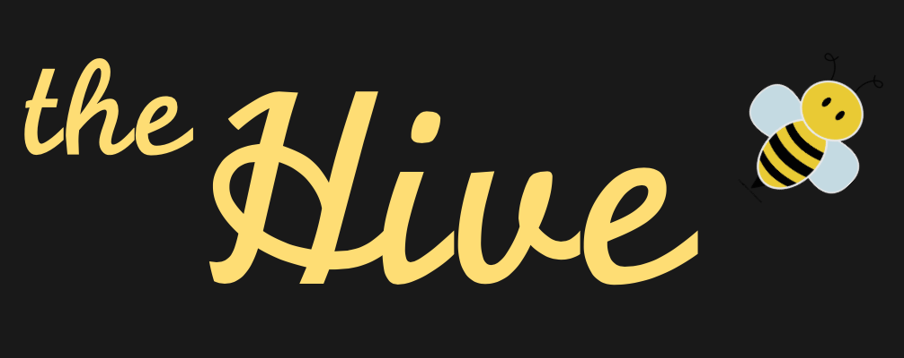

# the Hive #

## Overview ##

This social media app allows a user to:
* Sign up and create an account
* Send a 'buzz' or short message
* View their feed and see buzzes from other users
* Like a buzz and view their liked buzzes
* View other user's profiles and their liked buzzes
* Delete a buzz
* Edit a buzz
* Edit profile
* Login and out

## Built With ##
Ruby on Rails, ActiveRecord, Bootstrap, CSS

## Features ##
* Full CRUD functionality
* An easy to navigate layout and unique branded design.

## Try it yourself ##

## Resources used ##
* [Axure](https://www.axure.com/) - Creating mockups/prototypes for site layout and design
